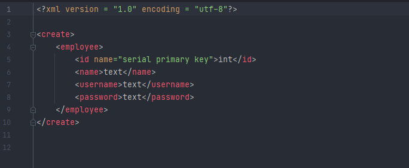

# Project 1 (ORM)

(ORM) is a technique that lets you query and manipulate data from a database using an object-oriented project. This mapping tool will allow provide developers simple methods that will take care of sql statements.   

## Methods DML(CRUD)
```python
insert()           Insert statement with object passed as an arguement


update()           Update statement on object id or primary key


delete()
deleteByValue()    Deletes statement by id or specific value.


read()
readByValue()      Select statement returns entire table or by value

```

## Methods DDL (Drop/Create)
```bash
create("file path")

drop("file path")
```
**__Example__**

```bash
xmlManager file = file.create("src\\main\\resources\\create.xml"));
xmlManager file = file.drop("src\\main\\resources\\drop.xml"));
```

## XML Schema Example
  
   

## License
